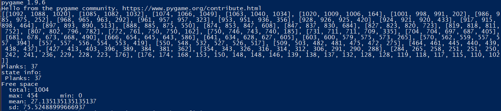
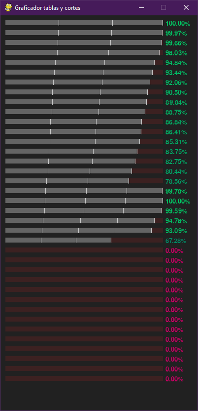
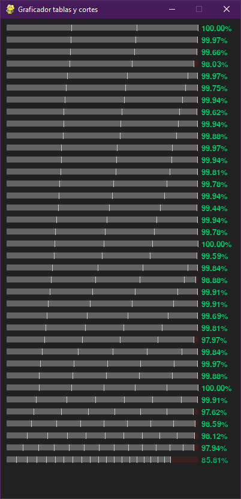

# Desafio1 GrupoRA
Algoritmo best first para la resolución de problema de cortado de tablas en una 
dimensión.

## Video explicativo
Para obtener una explicación de cómo funciona esto puede ver [este video](https://drive.google.com/file/u/1/d/1fsLXOFWmeuA4X38TvQgicyurzoBK_ky9/view?usp=sharing).

## Instrucciones

Requiere python 3 y pygame v1.96.

### Ejecución

Para ejecutar se debe ejecutar el siguiente comando.

``` $ python3 main.py -s <seed> -pl <plank-length> -c <cuttings> -m <min-lenght> -r <rad> -g```

El código se puede ejecutar directamente sin argumentos o con cualquiera de los presentados

* -s --seed: semilla aleatoria para la ejecución. Por defecto 1234567.
* -pl --plank-length: largo que tendrán las tablas que serán cortadas. por defecto 3200.
* -c --cuttings: cantidad de cortes que se realizarán a las tablas. por defecto 200.
* -m --min: largo mínimo que tendrán los cortes. Por defecto 100.
* -r --rad: variación máxima del largo mínimo de un corte. Por defecto 1000.
* -g --graphic: Si se utiliza este argumento, se presentará la solución del 
problema de forma gráfica.

### Salida

Cuando termina la ejecución y se cierra el grafico de la búsqueda 
(en caso de que se haya ejecutado en modo gráfico), se retorna 
por consola la lista de cortes realizados en cada tabla junto con información de 
los espacios no usados.



Si el modo gráfico está activo, mostrará por pantalla como está siendo 
resuelta la instancia a través de la representación del estado de la búsqueda. 
las tablas son representadas por barras rojas, mientras que los cortes 
corresponden a barras grises delimitadas por un borde blanco a su lado derecho.
Por último, el porcentaje utilizado de cada tabla es representado como porcentaje
al lado derecho de cada tabla. Dicho porcentaje cambia de color respecto al total
llenado, rojo para una tabla sin utilizar y verde para una tabla llena.

Búsqueda en curso            |  Búsqueda finalizada
:-------------------------:|:-------------------------:
 | 

## Integrantes
* Franco Ardiles
* Ignacio García
* Rodrigo Galleguillos
* Braulio Lobo

## Descripción del problema
Como grupo elegimos implementar una solución al problema Bin Packing para el dimensionado de tablas.
El objetivo es lograr un perdida minima de material teniendo establecidas las dimensiones de los cortes.
La razón por la que elegimos este problema es porque nos hemos enfrentado a él en la vida real.
El algoritmo que resuelve el problema está explicado en el archivo *ALGORITMO.doc*

